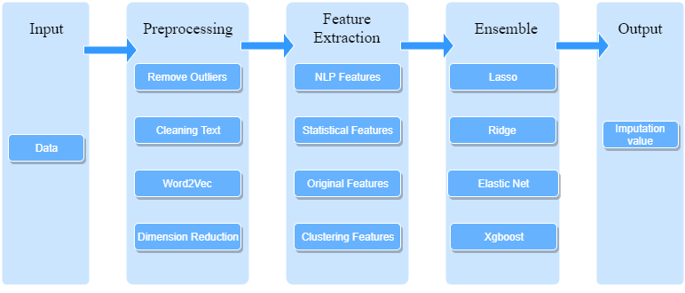

nstacart Market Basket Analysis
-----------------------

This competition gives customer orders over time, and the aim of this competition is to predict if existing customers will order the same products which they order previously. [here](https://www.kaggle.com/c/instacart-market-basket-analysis).

The best model we have obtained during the competition was ensemble the top 4 best models we have with F1 score maximization of Public LB score 0.4056450 (Rank 110/2623 top4%) and Private LB score 0.4034573(Rank 189/2623 top8%).

----------------------
### Download the data

### Download the data

* Clone this repo to your computer.
* Get into the folder using `cd Basket`.
* Run `mkdir data`.
* Switch into the `data` directory using `cd data`.
* Download the data files from Kaggle into the `data` directory.  
    * You can find the data [here](https://www.kaggle.com/c/instacart-market-basket-analysis/data).
    * You'll need to register with Kaggle and accept the agreement to download the data.
* Extract all of the `.zip` files you downloaded.
* Remove all the zip files by running `rm *.zip`.
* Switch back into the `Basket` directory using `cd ..`.

### Install the requirements
 
* Install the requirements using `pip install -r requirements.txt`.
    * Make sure you use Python 3.0.
    * You may want to use a virtual environment for this.

Usage
-----------------------

* Switch to `code/feature` directory using `cd code/feature`
* Run all R and Python files except `combine_all_features.R` to generate new features. The features files are all parallel, so they can be run in any order.
* Run `combine_all_features.R` after run all other files in `code/feature`.(it is not necessary to run this file, combining features also can be customed in `model/lgbm.py`)
* Switch to `model` dirctory
* Run `lgbm.py`.
    * This will dirctly train the lgbm model without CV, and predict the probability of each products
* Run `F1 score max.py`.
    * This will select the reordered products for each customer by maximizing F1 score.(This script is mainly contributed by faron)

