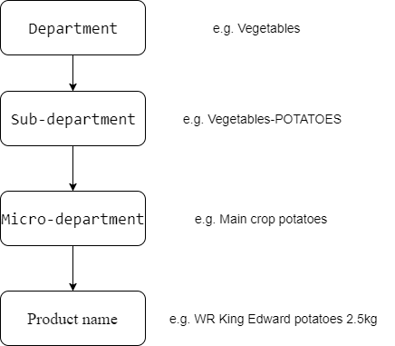

Missing Data Imputation by Textual Data for Food Product
-----------------------

This is my master dissertation. The goal of this dissertaion is using machine learning and data mining techniques to improve the ecoVerias current imputation method. EcoVerias method is that build a 3 level heriarchy structure (department, sub_department, micro-department) of the food product, and use the mean value of micro-department to replace the missing values. Because the products in micro-department are similar to each other. The figure below shows the hierarchy structure.

The challenges that we faced in this dissertaion are:
1. How to convert this problem to a machine learning problem.
2. The limitaion of the less number of features (we only can use six variables which are department, sub_department, micro-department, product names, product ID, and own brand.)

We define this is a regression problem and evaluate by MSE. We use the non-missing data as training set, and the miss data as test set, and encode hierarchy structure as categorical variables.

Based on our exploratory analysis, we find the product names have a potential affect on missing value. We decide to use this feature into our model by transforming the words to vectors and also use it as another way to group similar products. Once we have the word vectors, we can expand the feature by NLP.

The best model we have obtained during the dissertaion was ensemble the top 4 best models we have with MSE score 46.65, which improve 44.49% compared to ecoVerias method(MSE score 84.04).  

----------------------
### FlowChart

### Download the data

* Because of the confidentiality agreement, I cannot provide the data, but I suggest to crawl some data online to run the scripts

### Install the requirements
 
* Install the requirements using `pip install -r requirements.txt`.
    * Make sure you use Python 2.7.
    * You may want to use a virtual environment for this.

Usage
-----------------------

* Switch to `clean_code` directory using `cd clean_code`
* Run `make_feautures.R`, `create features.py`, `add cluster by word2vec.py` sequentially to create the features.
* Run `parameter tuning.py` to get the optimal hyper-parameters for models
* Run `train_models.py` to ge the final predict results.
 * We evaluate our model by 20 runs of 5-fold cross-validation

